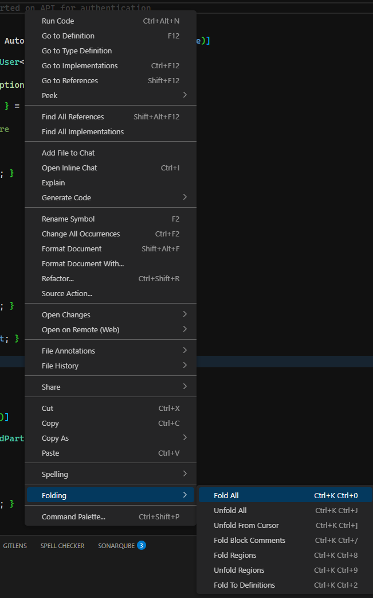

# fold-context-commands README

This simple extension adds commands to fold and unfold regions in the current editor.

## Features

- Fold all regions
- Unfold all regions
- Fold all regions under the cursor
- Fold all block comments
- Fold all marker regions (e.g., `#region` / `#endregion`)
- Unfold all marker regions (e.g., `#region` / `#endregion`)
- Fold to definitions (e.g., functions, classes). Similar to "Collapse to Definitions" command in Visual Studio

Describe specific features of your extension including screenshots of your extension in action. Image paths are relative to this README file.

For example if there is an image subfolder under your extension project workspace:

## Requirements

None

## Extension Settings

Folding must be enabled in VS Code settings for this extension to work. You can enable it by adding the following setting to your user or workspace settings, though it should be enabled by default.

- `"editor.folding": true`

## Known Issues

None

## Release Notes

### 1.0.0

Initial release of fold-context-commands.

### 1.0.1

Added description to package.json.

---
